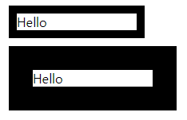
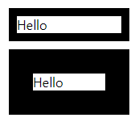
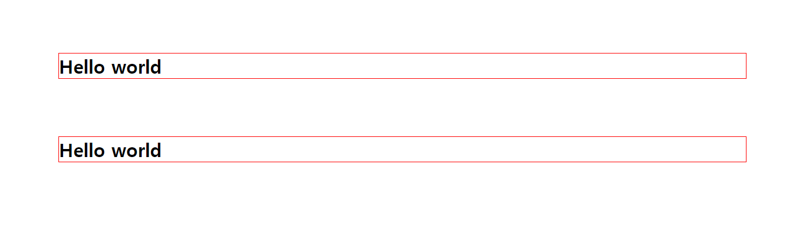
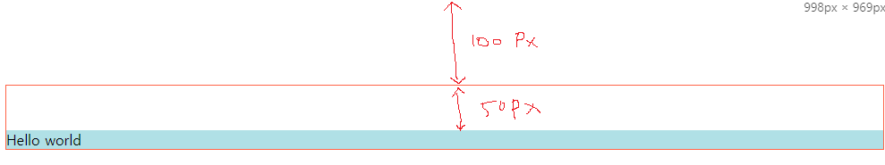
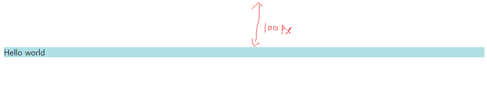

# Box model

- HTML element가 웹 페이지에서 차지하는 공간을 정의한 모델이다.
- HTML element들은 각각 자신만의 영역을 갖고 있으며, 각 영역은 다시 여러개의 작은 영역으로 나뉜다.


- 각 element는 가운데 실제 element의 내용이 담긴 부분(**content**), element를 감싸는 경계(**border**), border와 content 사이의 영역(**padding**), border 바깥의 영역(**margin**)으로 구성된다.
  - margin : element와 element의 영역도 가능합니다.

```css
p { 
    border: 10px solid red;
	padding:20px;
    margin:40px;
    width: 120px;
    height:50px; // 내용보다 높이가 작으면 컨텐츠가 이탈합니다. 그래서 잘 지정안합니다.
}

a {
    border: 10px solid red;
	padding:20px;
    margin:40px;
    width: 120px; // lnline 이기 때문에 무시됩니다.
    height:50px; // lnline 이기 때문에 무시됩니다.
}
```


# Box-sizing

```html
<!DOCTYPE html>
<html lang="en">
<head>
  <style>
    div {
      margin: 10px;
      width: 150px;
    }
    #small {
      border: 10px solid black;
    }
    #large {
      border: 30px solid black;
    }
  </style>
</head>
<body>
  <div id='small'>Hello</div>
  <div id='large'>Hello</div>
</body>
</html>
```

- 두개의 box-model의 element에게 `width`값을 부여해도 크기가 다릅니다.
  - 하얀색의 `content`크기의 영역은 같습니다. ( 150px )
  - border값이 포함되면서 element의 크기를 예상할 수 없게 됩니다.
  - 이것을 해결하기 위해 `box-sizing` 속성입니다.
    - `box-sizing: content-box` ( 디폴트 )
    - 
    - `box-sizing: border-box` ( border의 경계의 크기가 동일해집니다. )
    - 
- 글로벌로 적용해서 쉽게 개발할 수 있게 도와줍니다.

```css
* {
	box-sizing: border-box;
}
```


## 마진 겹침 현상-1

```html
<!DOCTYPE html>
<html lang="en">
<head>
  <style>
    h1{
      border: 1px solid red;
      margin: 100px;
    }
  </style>
</head>
<body>
  <h1>Hello world</h1>
  <h1>Hello world</h1>
</body>
</html>
```



- 위의 element와 아래의 element의 margin이 겹치는 현상이 발생합니다.
  - 두개의 element 중 더 큰값이 두 태그의 간격(margin)이 됩니다.

- 그럼 왜 margin 겹칩 현상을 만든 것인가?
  - 만약 list일 경우 보기가 안좋게 됩니다. 이런 것들을 보면 시각적으로 밨을 때 많은 태그들의 정렬들을 효과적으로 보이게 하기 위해서 라고 할 수 있다.

```html
<!DOCTYPE html>
<html lang="en">
<head>
  <style>
    li{
      margin:30px;
    }
  </style>
</head>
<body>
  <ul>
    <li>html</li>
    <li>css</li>
    <li>js</li>
  </ul>
</body>
</html>
```


# 마진 겹침 현상-2

- 자식과 부모사이의 마진 겹침 현상
  - `#parent` 의 `border:1px solid tomato;`을 주석처리하면 마진겹침 현상이 발생합니다.
  - 부모의 시각적인 효과(테두리 등)이 사라지게 되면(투명) 부모태그와 자식 태그의 마진값이 합쳐집니다. 
    - 부모와 자식 마진값 중 큰값이 마진값으로 사용 됩니다.

```html
<!doctype html>
<html>
  <head>
      <style>
          #parent{
             /* border:1px solid tomato; */
            margin-top:100px;
          }
          #child{
            background-color: powderblue;
            margin-top:50px;
          }
      </style>
  </head>
  <body>
      <div id="parent">
          <div id="child">
              Hello world
          </div>
      </div>
  </body>
  </html>
```

- 주석 처리 전



- 주석 처리 후
  - 만약 자식의 margin이 100px을 넘으면 자식의 기준으로 변하게 됩니다. ( **부모와 자식중 큰 값** )



# 마진 겹침 현상-3

- ` #empty`의 시각적인 요소를 주석처리하면 마진겹침 현상이 발생합니다.
- 만약 어떤 태그의 시각적인 요소가 없으면 그 태그의 마진값은 **위 마진값**과 **아래 마진값** 중 더 큰값이 그 태그의 마진 값이 됩니다. (스스로 마진 겹침)

```html
<!doctype html>
<html>
<head>
    <style>
        #empty{
            margin-top:50px;
            margin-bottom: 100px;
/*            border:1px solid tomato;*/
        }
        #normal{
            background-color: powderblue;
            margin-top:100px;
        }
    </style>
</head>
<body>
    <div id="empty"></div>
    <div id="normal">normal</div>
</body>
</html>
```

