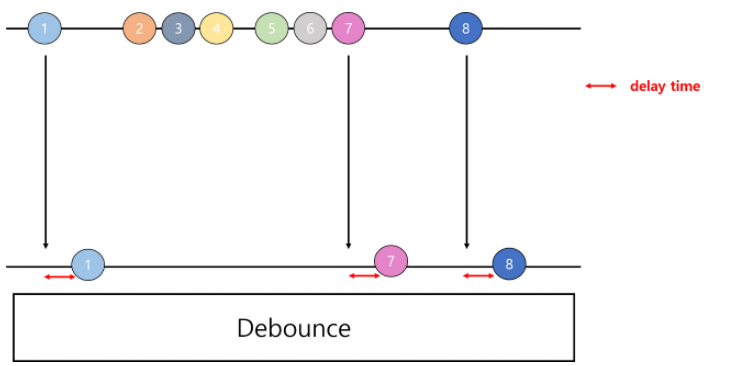
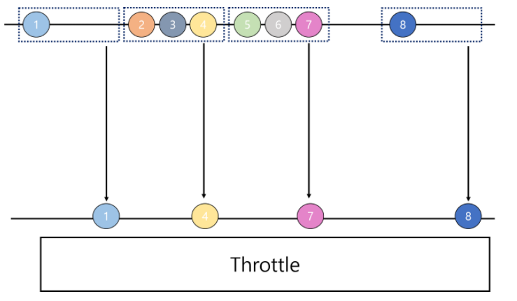

# Debounce & Throttle

- 사용해야 하는 이유 : keyboard 가 한자씩 입력될 때마다, api 로 데이터를 가져오게 되면, 사용자의 의도와 무관한 요청 이 자주 발생되는데, 이를 줄이기 위해, 입력이 끝난후나, 입력되는 중간 중간 200ms 마다 api 값을 가져온다면, 성능에서 매우 유리해 진다.

### 1. Debounce



- 이벤트를 **그룹화(Grouping)**하여, 연이어 호출되는 함수들 중 마지막 함수만 호출하도록 하는 기술
- 요청이 들어오고 **일정 시간을 기다린 후** 요청을 수행한다. 만약 일정 시간 안에 같은 요청이 추가로 들어오면 이전 요청은 취소된다
- 예를 들어, 다음과 같은 코드가 있다고 가정해봅니다

```js
<input id="input" />

document.querySelector('#input').addEventListener('input', function(e) {
  console.log('여기에 ajax 요청', e.target.value);
});
```

- 글자가 입력될 때마다, console.log **횟수가 증가하게 됨**
- 만약 변경사항이 있을때마다 유료 API가 요청이 된다면, 어마어마한 손해가 발생하게 됨
- 이럴 때, **Debounce**를 다음과 같이 정의할 수 있다!
  - 키보드 입력이 끊기면 한번 호출된다.

```js
let timer;
document.querySelector('#input').addEventListener('input', function(e) {
  if (timer) {
    clearTimeout(timer);
  }
  timer = setTimeout(function() {
    console.log('여기에 ajax 요청', e.target.value);
  }, 200);
});
```


### 2. Throttle



- 일정 시간 내에 **한 번만 함수를 호출**하도록 하는 기술
- 보통 **성능 문제** 때문에 많이 사용
- 타이머가 설정되어 있으면 **아무 동작도 하지 않고**, 타이머가 없다면 타이머를 설정합니다. 타이머는 **일정 시간 후에 스스로를 해제**하고, **ajax 요청**을 날리게 하면 됩니다.

```js
let timer;
document.querySelector('#input').addEventListener('input', function (e) {
  if (!timer) {
    timer = setTimeout(function() {
      timer = null;
      console.log('여기에 ajax 요청', e.target.value);
    }, 200);
  }
});
```

