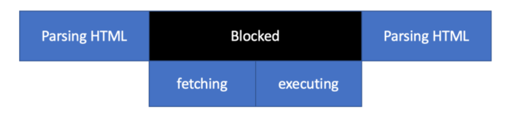
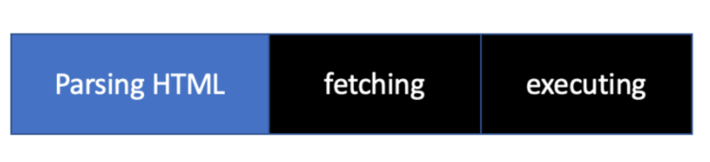
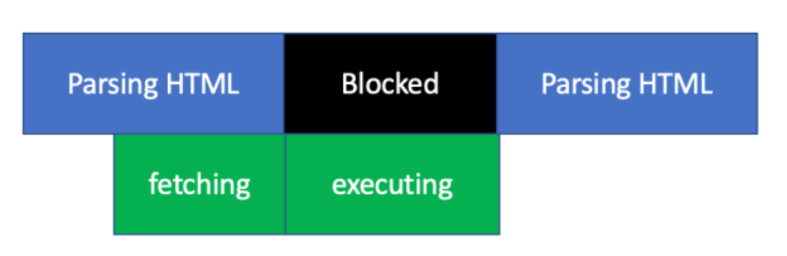

# Script 위치 및 async vs defer

- 보통 script를 이용해서 외부의 자바스크립트 파일을 import하려고 할 때, 4가지 경우를 생각할 수 있습니다.
  - head 내부에 import하는 로직을 넣으려고 할 때
  - body 맨밑에 import하는 로직을 넣으려고 할 때
  - async 키워드를 이용해서 import하려고 할 때
  - defer 키워드를 이용해서 import하려고 할 때


### 1. head 내부에 import하는 로직을 넣으려고 할 때

```html
<!DOCTYPE html>
<html lang="en">
  <head>
    <meta charset="UTF-8">
    <title>첫번째 head 내부에 script 파일을 import하려고 할 때</title>
    <script src="main.js"></script>
  </head>
  <body></body>
</html>
```



-  **parsing**하다가 script파일을 fetching -> executing하는 과정을 거칩니다.
- 단점 : 자바스크립트 파일이 너무 클 경우, 다운로드 받는데 오래 걸립니다. 즉, 다운로드 받는 것에 의해서 다음 HTML Parsing이 어렵다는 단점이 존재하게 됩니다.


### 2. body 맨밑에 import하는 로직을 넣으려고 할 때

```html
<!DOCTYPE html>
<html lang="en">
  <head>
    <meta charset="UTF-8">
    <title>두번쨰 body 맨 끝에 script 파일을 import하려고 할 때</title>
  </head>
  <body>
    <div>hello hi</div>
    <script src="main.js"></script>
  </body>
</html>
```



- parsing하다가 fetching + executing하는 과정을 거칩니다.
- 단점 : 사용자가 fetching과 executing하는 시간을 기다려야 합니다.


### 3.  async 키워드를 이용해서 import하는 로직을 넣으려고 할 때

```html
<!DOCTYPE html>
<html lang="en">
  <head>
    <meta charset="UTF-8">
    <title>세번째 async 키워드를 사용할 때</title>
    <script async src="main.js"></script>   
  </head>
  <body>
  </body>
</html>
```



- async 키워드는 boolean 속성
- parsing을 하다가 async 키워드를 만나면 fetching을 해줍니다. 그리고 fetching이 완료되면 executing을 진행하게 되고, executing이 끝나게 되면 다시 parsing을 하게 됩니다.
- 단점 : 자바스크립트 파일을 실행하는 과정에서 parsing하지 못한 html에 접근할 가능성이 있게 됩니다.
- 여전히 사용자가 페이지를 보는데 오래 걸릴 수도 있습니다.


### 4. defer 키워드를 이용해서 import하는 로직을 넣으려고 할 때

```html
<!DOCTYPE html>
<html lang="en">
  <head>
    <meta charset="UTF-8">
    <title>네번째 defer 키워드를 사용할 때 </title>
    <script defer src="main.js"></script>   
  </head>
  <body>
  </body>
</html>
```

- defer 키워드는 boolean 속성
- parsing을 하다가 defer 키워드를 만나면 fetching을 해줍니다. 그리고 fetching이 완료되면 다시 HTML parsing을 하게 되고, parsing이 완료되면 fetching한 자바스크립트 파일을 실행합니다.
- 가장 **안정적인 옵션**입니다.


### 여러개의 파일을 받을때

- async : fetching을 할 때 다운로드가 끝나자마자 실행이 되기 때문에 자바스크립트 실행 순서를 보장하기 어렵습니다.

- defer : fectching이 다 끝나고, parsing이 끝나야 실행하기 때문에 보다 효과적으로 구현할 수 있습니다.


### 마지막으로

- js를 밑에 둬야하는 이유
  - HTML을 읽는 과정에 스크립트를 만나면 중단 시점이 생기고 그만큼 Display에 표시되는 것이 지연됩니다.
  - DOM 트리가 생성되기전에 자바스크립트가 생성되지도 않은 DOM의 조작을 시도할 수 있습니다.

- head에 script를 넣기 좋은 경우
  - 빠른 알림을 알려야할 때, DOM을 읽기 전에 ex) alert