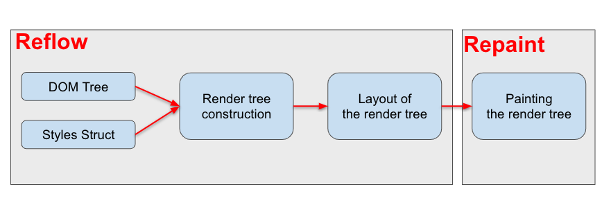

# Reflow & Repaint


### 브라우저 렌더링 과정의 일부

###### DOM (Documnet Object Model) Tree

- HTML 태그를 파싱하여 DOM 트리를 구성한다.


###### CSSOM (CSS Object Model) 생성

- 스타일 정보를 통하여 스타일 구조체를 생성한다. 스타일 정보는 다음과 같이 3 단계로 나누어 처리된다.

- 브라우저 자체에 포함된 기본 스타일 정보
- 사용자 정의 스타일 (외부 또는 내부에 정의된 스타일)
- HTML 태그에 style 속성을 이용하여 정의된 인라인 스타일 정보


###### Render tree construction (렌더 트리 생성)

- DOM 트리의 루트(html)에서 시작해서 페이지에 표시되는 각각의 노드에 일치하는 스타일 구조의 규칙을 찾아서 붙여나가며 렌더 트리를 생성한다.
- `<head>, <title>, <script> 등`은 화면에 표시되는 노드는 아니므로 렌더 트리에 포함되지 않는다.
- 스타일이 `display: none`으로 적용된 경우는 렌더 트리에 포함되지 않는다.
- `visibility: hidden`이 적용된 노드는 눈에 보이지는 않지만 렌더 트리에 포함된다.
- 렌더 트리에서 각 노드는 frame이나 box로 불리며, css박스 속성 정보가 있다.


###### Layout of the render tree (렌더 트리 배치)

- 생성된 렌더 트리로부터 엘리먼트의 위치나 크기 정보를 계산하여 생성한다.
- 이 과정에서 상대 값(예. %단위)은 절대 값(예. px단위)으로 변환되어 표현된다.


###### Painting the render tree (페인팅)

- 렌더 트리를 순회하면서 페인트 함수를 호출에 노드를 화면에 표현한다.


### Reflow

- 생성된 DOM 노드의 레이아웃 수치(너비, 높이, 위치 등)를 변경 시 배치를 다시해야하는 경우 영향 받는 모든 노드의(자신, 자식, 부모, 조상 등) 수치를 다시 계산하여 렌더 트리를 재생성하는 과정입니다.
- Reflow 과정이 끝난 후 재 생성된 렌더 트리를 다시 그리게 되는데 이 과정을 Repaint라고 합니다.


### Reflow가 발생하는 코드

```javascript
function reFlow() { 
    document.getElementById('container').style.width = '600px'; 
    return false; 
}
```

- Click 이벤트 handler 

- Recalcurate(변경된 스타일 수치 계산 수행) 

- Layout(Reflow 과정 수행) 

- Paint(Repaint 과정 수행)


### Repaint

- 스타일의 모든 변경이 레이아웃 수치에 영향을 받는 것은 아닙니다.
- Reflow가 발생하거나 배경색 변경 등의 단순한 스타일 변경과 같은 작업에 발생한다. 즉, 화면의 레이아웃에는 영향을 미치지 않는 경우에 발생한다.
  - 특정 엘리먼트의 색상 값 변화
- **background-color, visibillty, outline** 등의 스타일 변경시에는 레이아웃 수치가 변경되지 않으므로 Reflow 과정이 생략된 Repaint 과정만 일어나게 됩니다.
  - visibillty : 태그의 가시성을 결정합니다.

```css
#box1 { visibility: hidden; } = 보임
#box2 { visibility: visible; } = 숨김(영역은 차지)
#box3 { visibility: collapse; } = 겹치도록 지정
#box4 { visibility: inherit; } = 부모상속
```


### Reapint가 발생하는 코드

```javascript
function rePaint() { 
	document.getElementById('container').style.backgroundColor = 'red'; 
	return false; 
}
```

- Click 이벤트 handler 

- Recalcurate(변경된 스타일 수치 계산 수행) 

- Paint(Repaint 과정 수행)


### Reflow 과정이 일어나는 상황

- 노드의 추가 또는 제거시

- 요소의 위치 변경 시
  - positon, display(inline, block)

- 요소의 크기 변경 시
  - margin, padding, border, width, height 등 

- 폰트 변경 과(텍스트 내용) 이미지 크기 변경 시
  - (크기가 다른 이미지로 변경 시) 

- 페이지 초기 랜더링 시(최초 Layout 과정) 

- 윈도우 리사이징 시


### Reflow 최적화 방법

- 클래스 변화에 따른 스타일 변경 시, 최대한 DOM 구조 상 끝단에 위치한 노드에 주어야 합니다.
  - 말단에 위치한 노드의 수치를 변경하게 되면 리플로우 수행 반경을 전체 노드가 아닌 일부 노드로 제한 시킬 수 있게 됩니다.
  - Reflow 수행 비용을 줄일 수 있지만 실무 작업 시 적용하기에는 어려운 부분들이 많습니다.


- 인라인 스타일을 최대한 배제해야 합니다.
  - 적용 시 코드 가독성과 Reflow 비용을 줄일 수 있습니다.
  - 인라인 스타일이 없을 경우 외부 스타일 클래스의 조합으로 단 한번만 Reflow를 발생시킬 수 있습니다. 하지만 인라인 스티일이 많을 경우 리플로우는 페이지 전체에 걸쳐 수차례 발생하게 됩니다.


- 애니메이션이 들어간 노드는 가급적 **position:fixed** 또는 **position:absolute**로 지정하여 전체 노드에서 분리시키도록 해야 합니다.
  - Javascript와 CSS를 활용한 애니메이션 효과는 해당 프레임에 따라 무수히 많은 Reflow 비용이 발생하게 됩니다.
  - Position 속성을 fiedx와 absolute로 값을 주면 지정된 노드는 전체 노드에서 분리됩니다.
  - 이로써 전체 노드에 걸쳐 Reflow 비용이 들지 않으며, 해당 노드의 Repaint 비용만 들게 됩니다.
  - 또한 초기에 position 값을 적용하지 않아도 애니메이션 시작 시 값을 변경하고 종료 시 다시 원복 시키는 방법도 가능합니다.

```html
<script> 
function animation() { 
	document.getElementById('container_animation').style.left = '100px'; 			   		document.getElementById('container_animation').style.top = '100px'; 
    return false; 
} 
</script> 
<div id="container_animation" 	style="background:blue; position:absolute; top:0px; left:0px; width:100px; height:100px; border:red 1px solid;">
</div>

```


- 퀄리티와 퍼모먼스 사이에서 타협해야 합니다.
  - 애니매이션 효과는 보통 무수히 많은 Reflow 비용이 들어가게 됩니다.
  - 이 때에 애니메이션의 계산과 페이지 Reflow 계산이 동시다발적으로 발생함으로써 CPU 퍼포먼스 비용이 발생하는데 속도가 빠른 디바이스에서는 둘다 비슷하게 보일 수 있지만 스마트폰과 같은 디바이스에서는 그 차이가 눈에 띌 수 있기 때문에 적당한 타협이 필요합니다.


- 테이블 레이아웃을 피해야 합니다.
  - 테이블로 구성된 페이지 레이아웃은 점진적 페이지 렌더링이 적용되지 않으며 모두 로드되고 계산된 후에야 화면에 뿌려기제 됩니다.
  - 만약 사용한다면 해당 테이블에 table-layout:fixed 속성을 주는 것이 디폴트값인 auto에 비해 성능면에서 더 좋다고 한다. 


- IE의 경우 CSS에서 JS표현식을 피해야 합니다.
  - CSS 표현식의 비용이 매우 높은 이유는 문서 전체 또는 문서 일부가 Reflow될 때마다 표현식이 다시 계산되기 때문입니다.
  - 애니메이션과 같은 변화에 의해 리플로우가 발생했을 때, 경우에 따라 초당 수천, 수만번의 표현식 계산이 진행될 수 있다는 것을 의미합니다.

```css
.expression { 
    width: expression(document.documentElement.clientWidth > 0 ? '1000px' : 'auto'); 
}
```


- CSS 하위 선택자는 필요 만큼만 정리해야 합니다.
  - 하위 선택자의 룰이 적을 수록 비용이 절감됩니다.

```css
// 비용증가
.section_service .list_service li .box_name .btn_more {display:block;width:100px;height:30px;}

// 비용감소
.section_service .list_service .btn_more {display:block;width:100px;height:30px;}
```


- position:relative 사용 시 주의해야 합니다.
  
  - 페이지를 새로 열거나 Reflow가 발생되어 CSS Calculation이 발생할 경우, Box model Calculation → Normal Flow→Positioning 의 순서로 계산이 진행됩니다. 
  - Normal flow는 Layout 또는 Reflow라 불리는 과정에 속하는 일부입니다.
  - 일반적인 경우, 엘리먼트 들은 margin, border, padding, content(width,height) 등 Box model을 먼저 계산한 후 Normal flow 상태의 레이아웃에 배치된다. (다른말로 선형적 배치)
    
    - Position:absolute 또는 fixed일 경우 Norbal flow를 거치지 않고 바로 Positioning을 진행합니다.
  - 즉 position:relative가 오히려 position:absolute 또는 float 속성보다 더 큰 비용을 가진다.
    
    - 3단계를 모두 거치기 때문에...
    
    

- JS를 통해 스타일 변화를 줄 경우 가급적 한번에 처리해야 합니다.

```javascript
//여러번 중복된 Reflow와 Repaint를 유발시킵니다.
var toChange = document.getElementById('elem');
toChange.style.background='#333';
toChange.style.color='#fff';
toChange.style.border='1px solid #ccc';

//한번에 처리
/* CSS */
#elem {border:1px solid #000;color:#000;background:#ddd;}
.highlight{border-color:#00f;color:#fff;background:#333;}

/* js */
document.getElementById('elem').className='highlight';
```


- 캐쉬를 활용한 Reflow 최소화합니다.
  - 브라우저는 레이아웃 변경을 큐에 저장했다가 한번에 실행하는 방법으로 Reflow 수를 줄입니다. 
  - 하지만 offset, scrollTop, scrollLeft, 값과 같은 계산된 스타일 정보를 요청할 때마다 정확한 정보를 제공하기 위해 큐를 비우고 모든 변경을 다시 적용합니다. 
  - 즉, 중복되는 수치에 대한 스타일 정보를 변수에 저장(캐쉬)해 요청수를 줄임으로써 Reflow 비용을 최소화시킵니다.

```javascript
function collect() { 
    var elem = document.getElementById('container'); 
    var cw = elem.style.width; 
    return parseInt(cw, 10) * parseInt(cw + document.documentElement.clientWidth, 10); 
    return false; 
}
```


- DOM 사용을 최소화하여 Reflow 비용 줄일 수 있습니다.
  - 노드 조각과 노드 사본을 활용할 수 있습니다.

```javascript
// 비용 증가
function ex1BadCase() {
	var el = document.getElementById('container'); 
	for (var i = 0; i < 10; i++) { 
		var a = document.createElement('a'); 
		a.href = '#'; 
		a.appendChild(document.createTextNode('test' + i)); 
		el.appendChild(a);
	}
	return false; 
}

// 노드 조각(document.createDocumentFragment)
function noReflow() {
	var frag = document.createDocumentFragment(); 
	for (var i = 0; i < 10; i++) { 
		var a = document.createElement('a'); 
		a.href = '#'; 
		a.appendChild(document.createTextNode('test' + i)); 
		frag.appendChild(a); 
	} 
	document.getElementById('container').appendChild(frag); 
	return false; 
}

// 노드 사본(el.cloneNode)
function noReflow() {
	var el = document.getElementById('container');
	var clone = el.cloneNode(true);
	
	for (var i = 0; i < 10; i++) { 
		var a = document.createElement('a'); 
		a.href = '#'; 
		a.appendChild(document.createTextNode('test' + i)); 
		clone.appendChild(a); 
	} 
	el.appendChild(clone);
	return false; 
}
```


- Will-cahnge

  - will-change는 변화가 예상되는 요소를 브라우저에게 미리 알려주는 CSS 속성입니다.
    - 웹 어플리케이션이 진화함으로서 opacity, transform 등의 CSS 속성 값이 동적으로 변화는 상황이 갈수록 자주 생기게 되는데 동적으로 변화하는 상황시에 will-change 속성을 이용하면 브라우저에 엘리먼트의 어던 속성이 높은 확률로 변할 것인지 알려 줄 수 있습니다.
    - 브라우저는 이것을 통해 앞으로 동적으로 변화할 값을 알고 더 부드러운 이벤트를 구사합니다.
  - 이로써 브라우저는 실제 요소가 변화되기 전에 적절하게 최적화를 할 수 있습니다. 
  - 큰 비용이 드는 변화도 최적화로 인해 페이지의 반응성을 증가시킬 수 있습니다.
  - wil-change 속성을 사용하면 해당 레이어는 GPU에 업로드 됩니다.
  - 너무 많은 속성과 요소에 will-change 속성을 사용하면 안됩니다.  최적화를 하기 위해 더 많은 자원이 소모하기 때문입니다. ( 오히려 성능 약화 )
    - will-change를 사용하지 않아도 페이지가 잘 작동된다면 will-change를 사용하지 않아도 됩니다. 조금 더 빨리하기 위해 will-change 속성을 추가하면 과도한 메모리 사용과 더 복잡한 렌더링으로 성능이 더 안좋아 질 수 있습니다.
  - will-cahnge의 4가지 속성

  ```css
  will-change: auto;
  will-change: scroll-position;
  will-change: contents;
  will-change: transform;
  will-change: top, left;
  ```

  - auto
    - 기본값으로 브라우저는 별다른 최적화를 실시하지 않습니다.
  - scroll-position
    - 스크롤 할 때 엘리먼트의 위치가 변경될 것을 알려줍니다. 이 값을 설정하면 브라우저는 스크롤 가능한 엘리먼트를 미리 최적화 하여 랜더링 합니다. 한 번에 많은 양을 스크롤하거나 빠른 스크롤이 필요한 경우에 사용합니다.
  - contents
    - 엘리먼트의 컨텐츠가 변경될 것을 알려줍니다. 브라우저는 보통 엘리먼트의 랜더링 결과를 캐싱합니다. 대부분의 엘리먼트가 변경되지 않고 변경되어도 위치가 바뀌는 정도의 미미한 변경만 발생하기 때문입니다. 하지만 엘리먼트가 계속해서 변경되는 경우 브라우저 캐시는 무의미하게 됩니다. 이 속성을 사용하게 되면 캐시를 하지 않고 변경될 때마다 처음부터 랜더링하게 됩니다.
  - \<custom-ident>
    - 변경하고 싶은 속성을 사용할 수 있습니다. 쉼표(,)를 이용하여 두 개 이상의 속성을 사용할 수 있습니다. 크롬에서는 현재 6가지 속성(opacity, transform, top, left, right, bottom)만 적용됩니다. 

  - 적용 예시
    - 변화가 일어날 요소에 will-change를 직접 선언하면 적용되지 않습니다. 즉 미리 알려주어야 합니다.
    - will-change의 사용이 끝날시에는 다시 auto로 초기화를 시켜주는 것이 좋습니다.
      - will-change의 경우는 최적화를 길게 유지하게 됩니다. 그러므로 엘리먼트에 변경이 종료되면 반드시 will-change를 삭제해야 합니다. 그러면 will-change에 사용하고 있던 자원을 회수할 수 있습니다.

  ```css
  /* 변화할 요소와 will-change가 같이 있으므로 적용이 안 됨 */
  .box {
      transform: rotate(180deg);
      transition: transform 1s linear;
      will-change: transform;
  }
  
  /* hover를 통해서 will-change를 선언 했으므로 적용 */
  .button{
      will-change: auto;
  }
  
  .button:hover{
      will-change: transform;
  }
  
  .button:active{
      transform: scale(1.1);
  }
  ```

  