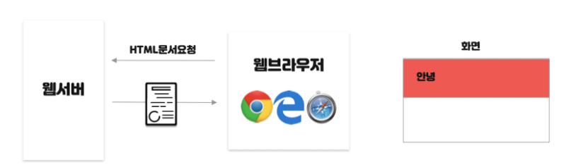
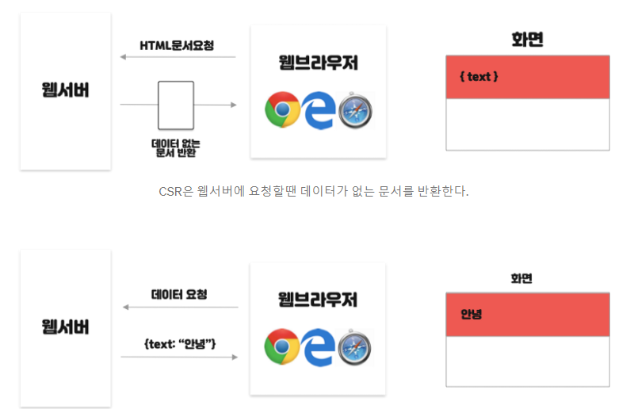

# SPA, SSR, CSR이란?

### 1. SPA(Single Page Application)

→ **단일 페이지**로 구성된 웹 어플리케이션

→ 서버로부터 **처음에만 페이지를 받아오고** 이후에는, **동적으로 페이지를 구성해서** 새로운 페이지를 받아오지 않는 웹 애플리케이션을 뜻함

**👍 SPA 장점**

(1) 하나하나 화면 전체를 렌더링할 필요가 없기 때문에 **화면이동이 빠르다**.

(2) 화면에 필요한 부분의 데이터만 받아서 렌더링 하기 때문에 **처리과정이 효율적**이다. (새로고침x)

(3) 유저에 입장해서 **사용하기 편리**하다.

**👎 SPA 단점**

(1) 처음 화면을 로딩할 때, 모든 화면이 미리 준비되어 있어야 하기 때문에 **로딩에 시간이 걸린다**.

- 초기에 웹 어플리케이션에 필요한 모든 정적 리소스를 다 받아야 합니다. ( body태그가 비어 있다. )

(2) 어플리케이션을 구현하는데 보다 **시간이 걸리며 복잡**하다.

### 2. MPA(Multiple Page Application)

- 사용자가 페이지를 요청할 때마다, 웹 서버가 요청한 UI와 필요한 데이터를 HTML로 파싱해서 보여주는 방식의 웹 어플리케이션이다. 사용자가 아주 사소한 요청을 해주어도(버튼 클릭 등) 매번 전체 페이지를 렌더링 해주어야 한다.
- 장점
  - SEO(Search Engine Optimization, 검색엔진 최적화) 관점에서 유리하다.
  - MPA는 완성된 형태의 HTML 파일을 서버에서 전달받기에 검색엔진이 페이지를 크롤링하기에 적합하다.
- 단점
  - 매번 페이지 전체를 새로 불러와서 렌더링 해야 하기 때문에 화면이 깜빡이는 등 성능상의 이슈가 있다.
  - 프론트와 백이 밀접하게 연관되어 있어서 개발 복잡도가 증가한다.

### 2. SSR(Server Side Rendering)

→ 서버에서 사용자에게 보여줄 **페이지를 모두 구성**하여 사용자에게 페이지를 보여주는 방식

→ **웹서버에 요청**할때 마다 Browser 새로고침이 일어나고 **서버에 새로운 페이지에 대한 요청**이 이루어지게 됨

**👍 SSR 장점**

(1) **초기 로딩 속도가 빠르기 때문에** 사용자가 컨텐츠를 빨리 볼 수 있다.

- JS 파일을 다운로드하고 적용하기 전에 이미 브라우저에 보여지기 때문입니다.
- 그래서 SEO에 사용되는 meta 태그들이 미리 정의되어 있기 때문에 SEO에 유리합니다.

(2) 모든 검색엔진에 대한 **SEO(검색엔진 최적화)가 가능**하다.

👎 **SSR 단점**

(1) 매번 페이지를 요청할 때마다 새로고침 되기 때문에 **사용자 UX가 다소 떨어진다**.

(2) 서버에 매번 요청을 하기 때문에 **트래픽, 서버 부하가 커진다**.

### 3. CSR(Client Side Rendering)

→ Client에 내장된 javascript 엔진이 **동적으로 html element 를 생성한 뒤**, **root element 에 추가**하여 웹 콘텐츠를 만드는 방식

- 즉 브라우저가 자바스크립트를 받아와 동적으로 렌더링을 하는 방식이다. 첫 로딩시에는 필요한 파일크기는 더 크지만 다 받기만 하면 동적으로 빠르게 렌더링 하기 때문에 사용자가 느끼는 UX에 유리합니다.
- 하지만 SSR와 다르게 하나의 HTML파일로 모든 페이지를 구성하기 때문에 meta 태그 정의에 약점이 있습니다.

**👍 CSR 장점**

(1) **Server 부담**을 줄일 수 있습니다.

(2) SSR 보다 조금 **더 빠른 인터랙션**이 가능합니다.

(사용자의 행동에 따라 필요한 부분만 다시 읽어들이기때문)

👎 **CSR 단점**

(1) Googlebot과 Searchconsole에 **검색 노출이 되지 않습니다**.

- SEO에 비효율(HTML body가 텅텅 비어져 있기 때문)

(2) **초기구동 속도가 느립니다**

(페이지를 읽고, 자바스크립트를 읽은 후 화면을 그리는 시간까지 모두 마쳐야 콘텐츠가 사용자에게 보여지기 때문)

### 4. 정리

- MPA가 주로 SSR을 사용하고 SPA가 주로 CSR을 사용하는 것을 중심으로 의미를 알아야 한다.
- MPA/SPA는 페이지를 여러개 쓰는지 또는 한 개 쓰는지에 대한 개념이고 SSR/CSR은 렌더링을 서버에서 하는지, 클라이언트에서 하는지에 대한 개념이다.
- SEO(Search Engin Optimiztion) : 검색엔진 최적화는 웹페이지 검색엔진이 자료를 수집하고 순위를 매기는 방식에 맞게 웹 페이지를 구성하여 검색 결과의 상위에 나올 수 있도록 하는 작업을 의미한다.
- 일반적으로 검색 엔진의 크롤러들은 데이터를 긁어올 때 웹 페이지의 JS를 해석해 노출시키기 때문에 크롤링을 할 수 없는 시점에서는 검색 엔진에 데이터를 노출시키지 않는 것이고, 이는 상대적으로 우리의 서비스가 검색 엔진 서비스에 노출되는 것이 줄어듦을 의미한다.
- 따라서 CSR을 사용하면 View를 생성하기 위해서 JS가 필요하고(그 전까지는 빈 페이지이기 때문에 View가 완성되지 않아서), View를 생성하기 전까지는 검색 엔진 크롤러의 데이터 수집이 제한적이기 때문에 상대적으로 검색 엔진이 이해하는 정보가 부족해 SEO에 유리하지 않게 된다.
- 반대로 전통적인 SSR은 View를 서버에서 렌더링해 제공하기 때문에(View를 먼저 그리기 때문에) 상대적으로 SEO에 유리해져 사용자 유입이 많을 것이다.
- 정리하면 전통적인 SSR은 초기 로딩 속도가 빠르고 SEO에 유리하지만, View 변경(화면 전환)시 계속적으로(새로고침하며) 서버에 요청해야 하므로 서버에 부담이 크다. 그리고 CSR은 초기 로딩 속도가 느리고 SEO에 대한 문제가 있지만, 초기 로딩 후에는 View를 서버에 요청하는 것이 아닌 클라이언트에서 직접 렌더링하기 때문에 화면 전환이 매우 빠르다는 장점이 있다.
- 이 두 가지 렌더링 방법을 적절하게 사용하여 첫 번째 페이지 로딩에서는 서버 사이드 렌더링을 사용하고, 그 후에 모든 페이지 로드에는 클라이언트 사이드 렌더링을 활용하는 방법을 많이 사용한다.
- React에서는 Next.js, GatsbyJS, Vue에서는 Nuxt.js 등의 라이브러리가 SPA에서 SEO을 할 수 있도록 도와준다. 많이 사용하는 Next.js의 경우 살펴보면 전통적엔 SSR이 아닌 SPA에서 SEO에 유리하기 위한 SSR를 도입하고 그 이외에도 개발자들이 직접 노드에서 환경설정을 해주지 않고도 익숙한 툴(바벨, 웹팩 등)을 가지고 설정을 할 수 있게 지원해 주기에 많은 React 개발자들이 선호한다.
- 또는 CSR에서 메타 태그를 정의해주는 라이브러리를 사용하는 것도 방법이다. 대표적인 라이브러리로 `react-helmet`이 있다. 이 라이브러리는 동적으로 SEO에 필요한 메타태그들을 쉽게 변경할 수 있도록 도와준다. JSX 또는 TSX 내부에서 메타태그를 관리할 수 있다.

### 개선 ( SSG )

- SSG (Static Site Generation) :  React + Next.js 
  - Next.js 는 강력한 SSR을 지원하는 라이브러리였지만 요즘에는 SSG 도 지원하고, CSR 과 SSR 을 섞어서 조금 더 강력하고 유연하게 사용할 수 있도록 지원해주고 있다.
  - react는 next.js를 활용해 첫 페이지 받아올대는 ssr 그다음은 csr(화면깜빡임없이 다른페이지이동)를 사용하기도 한다.
  - 이유는 검색에 잘 떠야되기 때문에.. ( ssr은 html이 다 그려져셔 오니까 .. ) => 검색시 상단에 올라갈 확률이 높고 화면이 빨리 뜬다.