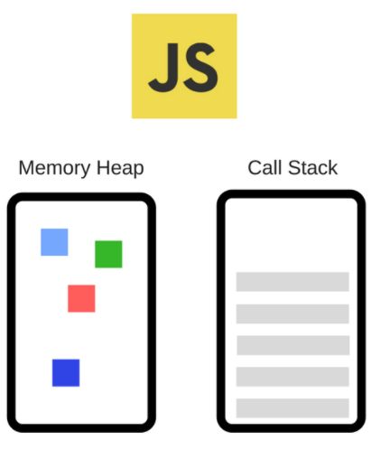
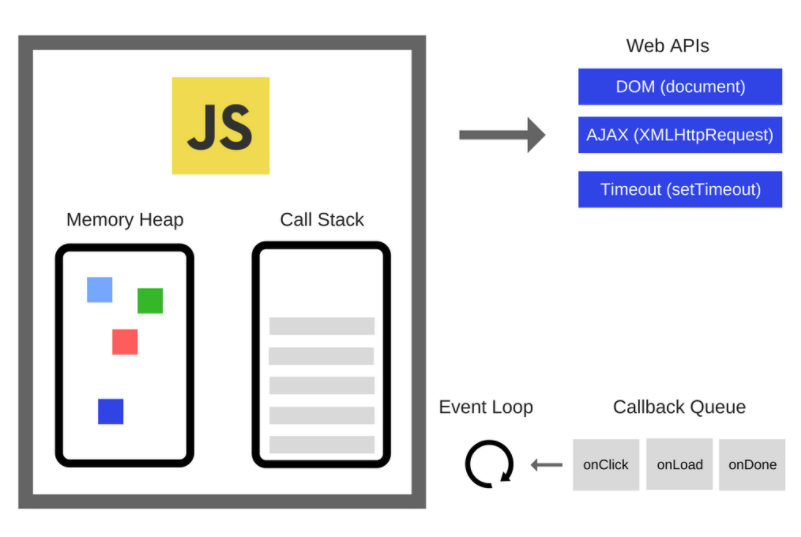
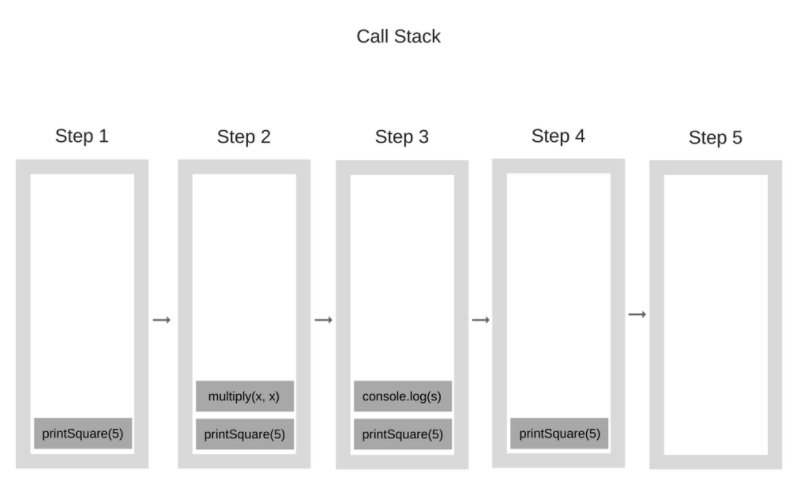

# 자바스크립트의 동작 원리


### 1. 자바스크립트의 엔진

- 자바스크립트의 엔진은 대표적으로 Google V8 엔진입니다. V8은 Chrome과 Node.js에서 사용됩니다.



- **Memory Heap** : 메모리 할당이 일어나는 곳
- **Call Stack** : 코드 실행에 따라 호출 스택이 쌓이는 곳, 자바스크립트는 하나의 메인스레드와 하나의 콜스택을 가지고 있습니다.


- 개발자들이 많이 사용하는 `setTimeout` 과 같은 내장 API를 사용하게 되는데 이 API는 자바스크립트 엔진에서 제공하는 것이 아닙니다.



- 이 그림처럼 자바스크립트 엔진 이외에도 자바스크립트에 관여하는 많은 요소들이 존재합니다.
- DOM, Ajax, setTimeout 과 같이 브라우저에서 제공하는 API 들은 Web API라고 부릅니다. 
- 그리고 이벤트 루프와 콜백 큐도 존재합니다.


### 2. 호출 스택(Call Stack)

- 자바스크립트는 기본적으로 싱글 스레드 기반 언어입니다. 즉 호출 스택이 하나인 것입니다. 그래서 한번에 한 작업만 처리할 수 있습니다.
  - 함수가 실행되면 해당 함수는 호출 스택의 가장 상단에 위치하게 되고 함수의 실행이 끝나면 함수를 호출 스택에서 제거합니다.

```javascript
function multiply(x, y) {
    return x * y;
}
function printSquare(x) {
    var s = multiply(x, x);
    console.log(s);
}
printSquare(5);
```



- 만약 무한 재귀를 통해 호출 스택의 최대 허용치를 넘게 되면 브라우저는 에러를 발생합니다.
- 싱글 스레드 기반이기 때문에 복잡한 문제나 시나리오를 고민하지 않아도 됩니다. ( 데드락 등 )
- 하지만 싱글 스레드로 모든 코드를 실행하는건 문제가 있습니다. 속도측면에서 말이죠! 그래서 이 부분을 해결하기 위해 이벤트 루프 등이 존재하게 됩니다.


### 3. 동시성과 이벤트 루프

- 만약에 호출 스택에 시간이 엄청 오래걸리는 함수가 존재하면  무한 대기상태가 되어 매우 비효율적으로 작동할 것입니다. 이것을 해결하기 위해 **비동기 콜백**이 존재합니다.


- line 1 : console.log(1)
  - **Call Stack**에 console.log("1") 추가
  - console.log("1") 실행, 콘솔창에 '1'이 출력
  - 실행 완료 후 **Call Stack**에서 console.log("1") 제거

- line 2 : setTimeout
  - Call Stack에 setTimeout(...) 추가
  - setTimeout(...) 실행, **Web API**의 timer 스레드에 작업을 넘김
    - 즉, 5초 간 기다리는 작업을 timer 스레드라는 서브 스레드에서 수행하는 것이다. 이 덕분에 메인 스레드에서는 **5초 간의 블로킹**이 일어나지 않고 다음 코드를 수행할 수 있다. 자바스크립트가 호출 스택이 하나인 싱글 스레드임에도 여러 가지 일을 동시에 처리하는 것처럼 동작할 수 있는 이유이다. 이를 **동시성(Concurrency)**라고 표현한다.
  - 실행 완료된 setTimeout(...)는 **Call Stack에서 사라진다.**
- line 3 : console.log(3)
  - **Call Stack**에 console.log("3") 적재
  - console.log("3") 실행, 콘솔창에 '3' 출력
  - 실행이 완료된 console.log("3") 는 **Call Stack에서 제거**


- 5초 뒤, Web API의 timer 스레드는 처리할 콜백함수를 **Callback Queue로 옮김**
  - (엄밀히 말하면 **5초의 대기를 보장하는 것**이지, 정확히 5초 뒤에 실행되는 것은 아님)
- 이벤트 루프가 Callback Queue에 있던 콜백함수를 **Call Stack에 추가**
  -  **이벤트 루프(Event Loop)는 항상 루프를 돌면서 Call Stack과 CallBack Queue를 확인한다**. 그러다 Call Stack이 빈 상태가 되면, Callback Queue에 있는 함수를 하나씩 Call Stack으로 올려주는 것이다.
- **Call Stack**에 올라간 함수가 실행되어, 콘솔창에 '2' 출력
- 실행이 완료된 console.log("2") 는 Call Stack에서 제거


### 4. 콜백 큐의 종류

- **task 큐에 넣는 함수** : setTimeout, setInterval, setImmediate I/O, UI 렌더링
- **animationFrame 큐에 넣는 함수** : requestAnimationFrame
- **microtask 큐에 넣는 함수** : Promise, Object.observe, MutationObserver
- microtask > animationFrame > task 큐 순으로 이벤트 루프가 진행이 됩니다.

```javascript
console.log('script start'); 

setTimeout(function() { // task 큐
  console.log('setTimeout');
}, 0);

Promise.resolve().then(function() { // microtask 큐
  console.log('promise1');
}).then(function() {
  console.log('promise2');
});

console.log('script end');
```

```javascript
/* 결과물 */
script start
script end
promise1
promise2
setTimeout
```

```javascript
// new Promise 생성한 경우
console.log('script start'); 

setTimeout(function() { // task 큐
  console.log('setTimeout');
}, 0);

new Promise(function(resolve) { // microtask 큐
  console.log('promise1');
  resolve();
}).then(function() {
  console.log('promise2');
});

console.log('script end');
```

```javascript
/* 결과물 */
script start
promise1
script end
promise2  
setTimeout
```


### 5. 마치며

- 자바스크립트는 **싱글 스레드**이지만 이벤트 루프, Web APIs(노드의 경우 C++ APIs), Callback Queue가 존재하기 때문에 비동기 콜백 작업이 가능하다.