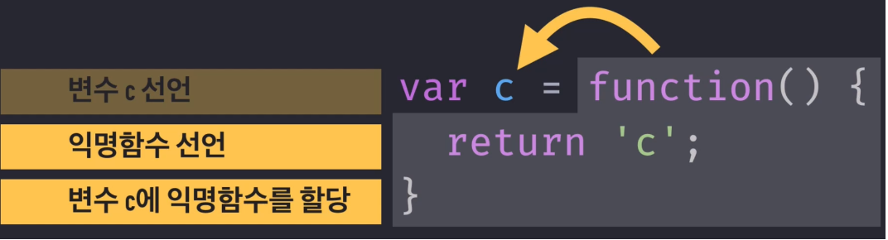

# 자바스크립트의 기초 개념 1


### 1. 자바스크립트의 데이터 타입

- Primitive Type(기본형) : 값을 그대로 할당합니다
  - Number, String, Boolean, null, undefined + 심볼
- Reference Tpye(참조형) : 값이 저장된 주소값을 할당(참조)합니다.
  - Object - (Array, Function, RegExp)
  - 메모리에 할당할 때 데이터를 넣지 않고 주소값을 할당하게 됩니다.
  - 그리고 객체는 따로 저장되어집니다. 즉 그 객체의 주소값을 따로 가져와 저장하는 것입니다.
  - 더이상 참조하지 않으면 그 객체는 G.C 대상이 됩니다.


### 2. 형변환

- 자료형을 바꾸는 행위를 의미하며 자바스크립트는 **명시적 변환**과 **암시적 변환**이 있습니다.

- 명시적 변환 

  - 개발자가 자바스크립트를 이용해서 직접 어떤 형으로 바꿀지 명시해주는 것을 의미합니다.
  - `Object(), Number(), String(), Boolean()`와 같은 함수를 이용하는데 new 연산자가 없으면 사용한 함수는 타입을 변환하는 함수로써 사용합니다.

  ```javascript
  // 문자 -> 정수
  const stringToNumber="3.14";
  console.log(parseInt(stringToNumber));
  
  // 문자 -> 실수
  const stringToFloat ="3.14";
  console.log(parseFloat(stringToFloat));
  
  // 숫자 -> 문자
  let numberToString = 15;
  console.log(String(numberToString));
  ```

- 암시적 변환

  - 자바스크립트가 자동으로 규칙을 통해 형변환을 해주는 행위를 의미합니다.

  ```javascript
  var result = 2 + "1";
  console.log(result) //21
  
  // 더하기(+)
  number + number // number
  number + string // string
  string + string // string
  string + boolean // string
  number + boolean // number ( true : 1, false: 0으로 취급)
  ```


### 3. 데이터 타입 비교

- `==` : 비교하는 두 개의 값을 강제로 같은 형으로 변환 후 비교를 수행합니다.
- `===` : 비교하는 두 개의 값의 타입과 값이 모두 같을 경우에만 `true`를 반환합니다.

```javascript
if(1 == '1'); // true
if(1 === '1'); // false

if(false == 0); // true
if(false === 0); // false

// 객체는 참조형 이기 때문에 주소값으로 비교함으로 모두 false
if ({} == {}) {
  console.log("true");
}
if ({} === {}) {
  console.log("true");
}

```


### 4. 호이스팅

- **변수의 선언**과 **함수의 선언**을 위로 끌어올려서 해당 유효 범위의 최상단에 선언하는 것입니다.
  - 실제로 코드가 글어올려지는 것이 아니라 자바스크립트 Parser 내부적으로 끌어올려서 처리한다는 의미
- **자바스크립트 엔진**은 코드를 실행하기 전단계로 코드 전반의 걸쳐서 선언된 내용들을 쭉 훑어보고 발견 즉시 위로 끌어 올립니다.

- **할당**하는 것은 해당사항이 아닙니다. **선언**만 끌어 올립니다.


### 5. 함수선언문과 함수표현식


- 예전에는 모든 브라우저들이 대무문 익명 함수표현식의 경우 함수에 값을 부여하지 않았기 때문에 디버깅 할 때에 **기명 함수 표현식**의 이점이 있었습니다. 하지만 최근 브라우저들은 함수명이 비어있으면 자동으로 변수명을 **name 프로퍼티**에 할당하기 때문에 이제는 **익명 함수 표현식**을 자주 사용합니다.



- 익명 함수 표현식의 장점
  - 함수 선언문
    - 실무에서 협업 중에 코드가 길어질 경우 다른 사람이 같은 함수를 선언하면 호이스팅에 의해 두 함수 선언문이 맨위로 끌어올려지게 되고 캐스케이딩 원칙으로 나중의 함수가 이전의 함수를 덮어 씌우는 현상이 발생합니다.

  

  - 익명 함수표현식 ( 콜백함수에서 자주 사용, 재사용 하지 않은 경우가 많으니 )

    - 익명 함수표현식을 사용하게 되면 캐스캐이딩에 의해 `sum` 변수가 하나만 존재하게 되지만 할당은 나중에 일어남으로 두 함수가 살아있게 됩니다.

    


### 6. 범위(Scope)

- 프로그램 언어에서 범위(Scope)는 **변수의 접근 가능과 생존 기간**을 뜻합니다.

- 전역 범위(Global Scope), 지역 범위(Local Scope)가 존재합니다.

  - 전역 범위(Global Scope)는 코드 전체에서 참조 가능한 것을 의미합니다.
  - 지역 범위(Local Scope)는 정해진 코드 부분에서만 참조 가능한 것을 의미합니다.

- 자바스크립트에서의 스코프

  - 함수가 정의될때 결정됩니다. 즉 변수의 범위는 **함수 단위** 입니다.

  - 함수 범위의 변수 선언은 **호이스팅**이 이루어집니다.

  - 변수관리는 **렉시컬 스코프**를 기준으로 합니다.

    - 렉시컬 스코프 : 함수가 선언이 되는 위치에 따라 상위 스코프가 결정되는 스코프입니다.

    ```javascript
    let x = 'global'
    
    function foo(){
      let x ='local'
      bar()'
    }
    function bar(){
      console.log(x)
    }
    foo() //global
    bar() //global
    ```

  - 변수 검색은 **스코프체인**을 이용합니다.

    - 스코프체인 : 자바스크립트 엔진이 식별자를찾을 때 일단 자신이 속한 스코프에서 찾고 그 스코프에 식별자가 없으면 상위 스코프에서 다시 찾아나가는 현상을 의미합니다.

    ```javascript
    var x = 1;
    
    function foo(){
        // 현재 자신의 스코프(foo 함수 내부)에 x가 없지만 상위 스코프인 전역에서 x를 찾는다.
        console.log(x); 
    }
    
    console.log(x); // 1
    foo(); // 1
    ```

- 함수의 범위

  - 함수 내부에서 선언된 변수는 함수 내부에서만 접근이 가능합니다.
  - var 키워드 없이 선언한 변수는 window 객체의 변수로 **전역 변수**로 사용 가능합니다.

  ```javascript
  var variable = 1;
  
  function functionScopeTest() {
  if(true){
    var data = 1;
  }
  console.log(data); // 1출력
  
  }
  functionScopeTest();
  ```

- 블록 범위

  -  **let**과 **const** 키워드를 사용할 경우 블록 범위를 가집니다. 

  ```javascript
  function useVarKeyword() {
    for(var i=0; i<3; i++){}
    console.log(i); // 3
  }
  
  function useLetKeyword() {
    for(let i=0; i<3; i++){}
    console.log(i); // ERROR!
  }
  ```

  

### 7. 실행 컨텍스트(Execution Context)

- 자바스크립트 엔진이 코드의 해석과 실행의 복잡성을 관리하기 위해 만든 것입니다.

- 실행되는 코드 덩어리로써 함수가 실행될 때 생성됩니다.
- **실행 컨텍스트**가 실행되면 호이스팅이 이루어진 후의 **코드 함수 본문내용**과 **this**가 무엇인지에 대한 정보가 담기게 됩니다.
- 한마디로 사용자가 함수를 호출할 때 내부적으로 함수를 실행하기 위해 필요한 정보들을 불러놓은 집합체 입니다.
- 자바스크립트 엔진이 코드를 처음 실행할 때 처음으로 생성되는 실행 컨텍스트는 `Global Execution Context`입니다.
  - 구성요소
    - `global object`
    - `this`라는 변수
  - 실행 컨텍스트는 두 개의 단계가 있으며 각자 고유의 역할이 존재합니다.
  - 생성단계 : window, this가 생성되고, 변수가 선언되고 (name, handle) 기본값으로 undefined가 할당됩니다. 그리고 선언식 함수 getUser는 메모리에 전부 올라가게 됩니다.
    - global object를 생성
    - this 변수 object를 생성
    - 변수와 함수를 위한 메모리공간 확보
    - 선언식 함수를 메모리에 배치하면서 변수 선언에 기본값 undefined를 할당
  - 실행단계 : 자바스크립트 엔진이 코드를 한줄씩 실행합니다. 그리고 진짜 값을 이미 메모리에 있는 변수에 할당합니다.


- 함수 실행 컨텍스트 : **함수가 호출될 때 생성**됩니다.
  - 함수가 종료되면 해당 실행 컨텍스트는 사라지고 모든 작업이 끝나면 전역(글로벌) 컨텍스트도 사라지게 됩니다.
- 자바스크립트 엔진은 글로벌 실행 컨텍스트와 동일하게 4가지를 수행하며 object 종류만 다릅니다.
  - **arguments object 를 생성**
  - this 변수 object를 생성
  - 변수와 함수를 위한 메모리공간 확보
  - 선언식 함수를 메모리에 배치하면서 변수 선언에 기본값 undefined를 할당


- 실행컨텍스트 예시

```javascript
var name = 'zero'; 
function wow(word) 
  console.log(word + ' ' + name);
}
function say () { 
  var name = 'nero';
  console.log(name);
  wow('hello'); 
}
say(); 
```

```javascript
'전역 컨텍스트': {
  변수객체: {
    arguments: null,
    variable: ['name', 'wow', 'say'],
  },
  scopeChain: ['전역 변수객체'],
  this: window,
}
```

```javascript
'say 컨텍스트': {
  변수객체: {
    arguments: null,
    variable: ['name'], // 초기화 후 [{ name: 'nero' }]가 됨
  },
  scopeChain: ['say 변수객체', '전역 변수객체'],
  this: window,
}
  
'wow 컨텍스트': {
  변수객체: {
    arguments: [{ word : 'hello' }],
    variable: null,
  },
  scopeChain: ['wow 변수객체', '전역 변수객체'],
  this: window,
}
```


- 실행 컨텍스트 2가지 예시

  - 그림 1

  
  - 전역 스코프 존재 => 전역 실행컨텍스트 생성
  - 호이스팅과 this바인딩 실행( 변수 a 선언, 함수 outer 선언 => outer 스코프 정의됨 )
  - 호이스팅 끝 => 변수 a에 1을 할당, outer 함수 실행
  - outer 실행컨텍스트 생성 => 호이스팅과 this바인딩 처리
  - 함수 inner 선언 및 inner 스코프 생성
  - 다시 위에서 아래로 코드 실행 ( console.log(a) => outer 스코프에 없으니 global 스코프에서 탐색 후 1 출력)
  - inner 함수 실행=>inner 실행컨텍스트 생성 => 호이스팅(변수 a 선언)
  - console.log(a) 실행 -> inner 스코프에서 a를 탐색( a 선언되었으나 값이 없음 )
  - a에 3을 할당
  - 나머지 console.log(a)는 전역 스코프에서 탐색
  - 그림 2

  


### 8. 즉시실행함수

```javascript
// 에러 : 자바스크립트가 function foo() {}. ()으로 인식, 함수선언문이기 때문..
function foo() {}();

// 괄호로 감싸야 한다.
(function foo() {})();
```


### 9. `null`, `undefined`, 선언되지 않은 변수

- 선언되지 않은 변수 : var, let, const를 붙여서 변수를 선언하지 않은 코드를 말합니다. 이것은 strict 모드에서는 레퍼런스 에러가 발생하고 그냥 실행하면 전역에 추가됩니다. ( 사용하지 말자! )
- undefined : 선언은 됬지만 값을 할당하지 않은 상태를 의미합니다.
  - 사용하지 않을거면 null을 넣어 명시적으로 표현하는 것이 좋습니다.

```javascript
// 주의
console.log(undefined == null); // true
console.log(undefined === null); // false
```

