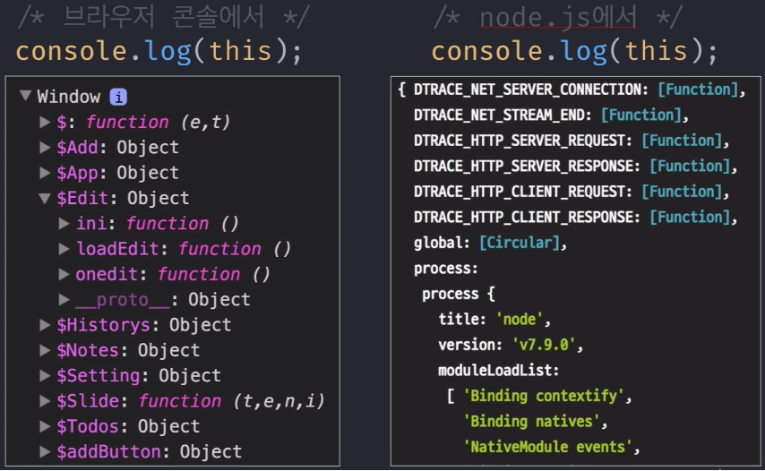
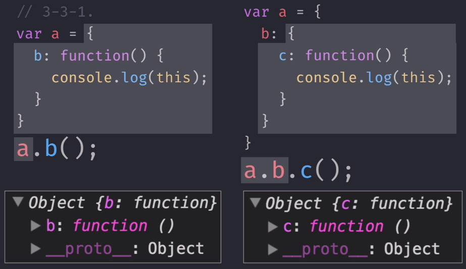

# 자바스크립트의 기초 개념 2


### 1. 콜백함수

- 제어권을 넘겨주거나 맡기는 것을 의미합니다.

```javascript
// setInterval() : 일정시간으로 넘겨받은 함수를 호출해준다.
// 첫번째 인자 : 콜백 함수
// 두번째 인자 : 주기(ms)
setInterval(function (){ 
      console.log('1초마다 실행될 겁니다');
}, 1000);

// 콜백함수의 제어권을 setInterval에게 넘긴것이다.
```


- `forEach`가 정해놓은 규칙대로 콜백함수의 인자값을 넣어야 합니다.

```javascript
var arr = [1, 2, 3, 4, 5];
var entries = [];

// forEach : 해당 배열을 순회하면서 콜백함수를 실행시켜라!
// 첫번째 인자 : 콜백함수(첫번째 인자 : value, 두번째 인자 : index)
// 두번째 인자 : this로 인식할 대상(생략 가능, window)
// 세번째 인자 : Array (forEach()가 적용되고 있는 배열)
arr.forEach(function(v, i){
    entries.push([i, v, this[i]]);
}, [10, 20, 30, 40, 50]);
//콜백함수의 인자 : 1.value(배열에서 현재 처리중인 요소), 2.index(인덱스),

// [[0, 1, 10],[1, 2, 20],[2, 3, 30], [3, 4, 40], [4, 5, 50]]
console.log(entries);
```


- DOM Event

```javascript
document.body.innerHTML = '<div id="a">abc</div>'
function cbFunc(x){
    console.log(this, x);
}

document.getElementById('a').addEventListener('click', cbFunc);

/* abc 클릭시 출력 */
// this : <div id="a">abc</div>
// x: MouseEvent {isTrusted: true, screenX: 11, ...}

// this에 바인딩한것이 없어서 글로벌(window)객체가 나와야 하는데 div 엘리먼트가 나옵니다.
// x에는 어떤 인자를 넘겨서 실행한게 아닌데 x에는 자동으로 마우스 이벤트가 담겨있습니다.
// 이유은 addEventListener 규칙에 콜백함수 첫번째 인자 : 이벤트 객체, this는 이벤트 타겟으로 정해져 있습니다. ( addEventListener( type, callback, options ) )
```


- 콜백함수의 특징
  - 다른함수(A)의 매개변수로 콜백함수(B)를 전달하면 A가 B의 제어권을 갖게 됩니다.
  - 특별한 요청(bind)이 없는한 A에 미리 정해진 방식에 따라 B를 호출합니다.
  - 미리 정해진 방식이란 this에 무엇을 바인딩 할지, 매개변수에는 어떤 값들을 지정할지, 어떤 타이밍에 콜백을 호출할지 등입니다.
  - **콜백함수**는 메소드가 아니고 함수입니다.
    - **메소드**로 정의되어있어도 이것을 **콜백함수**로 전달할때는 여러가지 문제가 발생합니다.

  ```javascript
  var arr = [1, 2, 3, 4, 5];
  
  var obj = {
  	vals: [1, 2, 3],
  	logValues: function(v, i){
  		if(this.vals){
  			console.log(this.vals, v, i);
  		}else{
  			console.log(this, v, i);
  		}
  	}
  };
  
  // 메소드 호출 => this는 obj가 됩니다.
  obj.logValues(1, 2); // 출력 : [ 1, 2, 3 ] 1 2
  
  // 콜백함수로 사용되면 forEach의 규정되어 있는 this 규칙을 따르게 됨으로써 window가 this입니다.
  arr.forEach(obj.logValues);
  ```

  

### 2. This

- 전역 공간 : Window / Global 객체를 가르킵니다.

  

- 함수 내부 : 기본적으로 Window / Global 객체를 가르킵니다.
- 메소드 호출 : 메소드를 호출하는 주체(  메소드명 `.`앞 )



```javascript
var a = 10;
var obj = {
    a: 20,
    b: function() {
        console.log(this.a); // 출력 : 20
        
        function c(){
            console.log(this.a); // 출력: 10
        }
        c();
    }
}
obj.b();

// 스코프 체인 사용
var a = 10;
var obj = {
    a: 20,
    b: function() {
        var self = this;
        console.log(this.a); // 출력 : 20
        
        function c(){
            console.log(self.a); // 출력 : 20
        }
        c();
    }
}
obj.b();
```

- This를 메소드를 통해 변경할 수 있습니다.

```javascript
function a(x, y, z){
	console.log(this, x, y, z);
}
var b = {
    c: 'eee'
};

// func.call(thisArg[, arg1[, arg2[, ...]]])
// a를 호출하는데 this는 b가 되었으면 좋겠고 인자는 1, 2, 3 인채로 호출해줘~
a.call(b, 1, 2, 3); // 출력 : { c: 'eee' } 1 2 3

// func.apply(thisArg, [argsArray])
// 두번쨰 인자자리에 매게변수를 몽땅 배열로 한번에 받는다. (call과 차이점)
a.apply(b, [1, 2, 3]); // 출력 : { c: 'eee' } 1 2 3

// func.bind(thisArg[, arg1[, arg2[, ...]]])
// call과 apply은 즉시 호출하는 명령, bind는 새로운 함수를 생성할뿐 호출은 하지 않습니다.
var c = a.bind(b); 
c(1, 2, 3); // 출력 : { c: 'eee' } 1 2 3

// this는 b가 되었으면 좋겠고 인자는 1, 2를 미리 넣어줄게 => 변수 d에 담아줘!
var d = a.bind(b, 1, 2);
//변수 d는 함수인데 1과 2는 이미 정의했고 3인자만 추가;
d(3); // 출력 : { c: 'eee' } 1 2 3
```

- 콜백 함수에서의 this
  - 기본적으로 함수의 this와 같다.
  - 제어권을 가진 함수가 callback의 this를 명시한 경우 그에 따른다.
  - 개발자가 this를 바인딩한 채로 callback을 넘기면 그에 따른다.

```javascript
var callback = function(){
    //1. 콜백함수는 함수니까 this는 전역객체바라봅니다. (Window)
    console.dir(this); 
}

var obj = {
    a: 1,
    b: function(cb){
        cb();
        //cb.call(this); 출력 : { a: 1, b: [Function: b] }
        //콜백의 제어권을 넘겨받은 함수나 메소드가 this를 다른 것으로 명시하면 Object가 보이게 된다.
    }
};
obj.b(callback); //콜백함수를 받아 그대로 실행하는 메소드
```

```javascript
var callback = function(){
    console.dir(this);
};
var obj = {
    a: 1
};
// this는 window가 나오게 된다.
setTimeout(callback, 100); 
// this는 obj가 나오게 된다.
setTimeout(callback.bind(obj), 100); 
```

```javascript
var obj = {
    a: 1
};

// 이벤트 핸들러에서 this가 이벤트가 발생한 dom객체인 것에 대한 이유가 설명가능해진다.
// addEventListener의 함수가 자체적으로 callback함수를 호출할때는 dom객체를 this로 명시했기 때문
document.body.innerHTML += '<div id="a>"클릭하세요</div>'

document.getElementById('a').addEventListener('click', function(){
    console.dir(this); // 출력 : <div id="a>"클릭하세요</div>
})

// 그 규칙을 무시하고 다른 것으로 대체 가능합니다
document.getElementById('a').addEventListener('click', function(){
    console.dir(this); // 출력 : obj 객체
}.bind(obj))
```

- 생성자 함수 : this는 인스턴스를 가르킵니다.

```javascript
function Person(n, a){
    // 자동으로 변수생성후 할당합니다.
	this.name = n; 
	this.age = a;
}

var gomugom = new Person('고무곰', 30);
console.log(gomugom);
```


### 3. 클로저(Closure)

- **함수**와 그 함수가 선언될 당시의 **스코프의 환경정보** 사이의 조합입니다. 그래서 함수 내부에서 생성한 데이터와 그 유효범위로 인해 발생하는 특수한 현상이나 상태들이 존재합니다.
- 보통 함수를 리턴하게 되면 리턴하는 함수가 클로저를 생성하게 됩니다.
  - **최초 생성시 생성된 스코프와 생성지 환경정보는 변하지 않습니다 => 최초선언시의 정보를 유지** ( 핵심 )
  - 정보를 그대로 유지할 수 있는 이유 : 스코프는 정의 될 때 결정되기 때문입니다.
- 접근 권한제어, 지역변수 보호, 데이터 보존 및 활용의 장점이 있다.

```javascript
//접근 권한제어와 지역변수의 보호
function a(){ //a 스코프
    var x = 1;
    
    function b(){//b 스코프
        console.log(x); //x 접근 가능
    }
    b();
}
a();
console.log(x); //x접근 불가
```


- 객체지향프로그래밍은 외부와의 데이터 연동이 매우 활발이 이루어져야 합니다. 그래서 함수의 내부에서만 활용하는 것이 아니라 외부에서도 사용할 수 있어야 합니다.

```javascript
function a(){ 
    var x = 1;
    return function b(){
        console.log(x); 
    }
}
var c = a();
c(); 
// 외부에서 x를 출력가능, 하지만 외부에서 x값을 바꿀순 없다.
// x값을 변경하려면 a함수의 내부에서 외부에서 바꿀수 있는 수단을 제공해야햔다. 즉 권한을 줘야 한다.
```

```javascript
// set, get을 이용해 권한 부여하기, 반환을 통해 권한을 부여
function a(){
	var _x = 1; //_x로 해놓은 지역변수는 보호가 된다.
    return {
        get x() { return _x; },
        set x(v) { _x = v; }
    }
}

var c = a();
c.x = 10;
```


- 클로저 예제
  - 여기서는 **클로저**란 이미 생명주기가 끝난 외부함수의 변수를 참조하는 함수를 의미, 반드시 이런 경우만 클로저를 사용하는 것은 아니다.

```javascript
function setCounter(){
	var count = 0;
    return function(){
        return ++count;
    }
}
var count = setConter();
count();
```


- 클로저를 활용해서 Private Member(지역 변수) 만들기

```javascript
var car = {
    fuel: 10, //연로
    power 2, //연비
    total: 0,
    run: function(km){
        var wasteFuel = km / this.power;
        if(this.fuel < wasteFuel){
            console.log('이동불가');
            return;
        }
        this.fuel -=wasteFuel;
        this.total += km;
    }
}
//문제 : car.power = 10; or car.fuel = 1000; 조작가능
// => 직접 변경할 수 없도록 만든다 => 스코프를 활용 => 지역변수로 만들기;
```

```javascript
var createCar = function(f, p){
    var fuel = f; 
    var power = p; 
    var total = 0;
    return{
        run: function(km){
        var wasteFuel = km / power;
        if(fuel < wasteFuel){
            console.log('이동불가');
            return;
        }
        fuel -=wasteFuel;
        total += km;
    	}
    }   
};
var car = createCar(10, 2);

// fuel, power, total의 변수들은 내부로 감추고 외부에는 run메소드만 노출시킴
// => 사용자는 run메소드만 사용 가능
```

- 함수에서 지역변수 및 내부함수 등을 생한다.
- 외부에서 노출시키고자 하는 멤버들로 구성된 객체를 return한다.
- return한 객체에 포함되지 않은 멤버들은 private하다
- return한 객체에 포함된 멤버들은 public하다.


### 클로저 정리

- 함수내부에서 다시 함수를 return하면 return된 함수는 **최초 선언시의 정보**를 유지한다. 그렇기 때문에 외부에 노출하려고 하는 data만 return하면 return하지 않은 data는 외부에서 접근제한할 수 있고 그 덕분에 지역변수를 안전하게 보호할 수 있으며 그러면서도 외부에게 지역변수의 변경권한을 부여함으로써 data를 활용할 수 있다. ( 정보 은닉 )