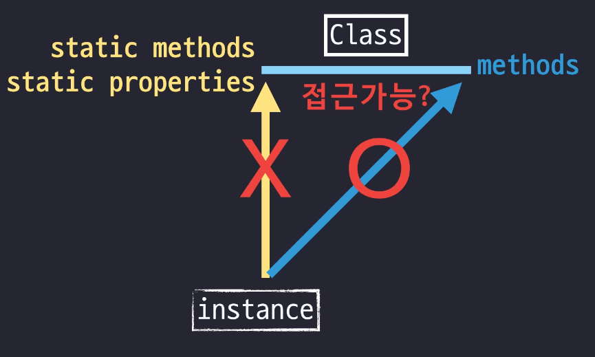

# 프로토 타입(ProtoType)

- ES6 문법 전에는 클래스가 존재하지 않았기 때문에 **프로토타입 기반**으로 자바스크립트는 구현이 되었고 프로토타입을 통해 객체지향언어처럼 **상속** 등을 흉내낼 수 있는 것을 의미합니다.
  - 최근에는 ES6 문법에서 `Class`가 추가되었지만 이것도 프로토타입기반으로 만들어진 것입니다.
- 장점 : 공통 되는 부분을 prototype에 정의 함으로써 재사용성이 높아지고, 메모리를 절약할 수 있다.
  - 프로그래머 역량에 따라 무척이나 유연한 프로그래밍이 가능하다.
- 단점 : 없을거라고 판단했던 속성이 프로토타입에 있어서 예상치 못하게 동작할 수 있다. 즉, 정확성, 예측성 및 안정성이 클래스형 보다 떨어질 수 있음.
  - 대표적으로 `for in`문으로 특정 객체의 프로퍼티를 열거할 때 그 프로퍼티가 가지고 있지 않은 프로퍼티가 상위에 프로토타입으로 존재할 경우 그것들도 같이 출력하는 오류가 생깁니다.


### 1. 생성자 함수

- **기존 함수에 new 연산자를 붙여서 호출하면, 해당 함수는 생성자 함수로 동작**합니다.
  - 함수가 일반적인 함수인지 객체를 만들기 위한 목적의 생성자 함수인지 구분하기 위해, 생성자 함수의 첫 문자는 **대문자**로 표기하는 것이 관례입니다.
- `new` 연산자를 통해 인스턴스를 생성하면 생성자 함수의 `prototype`이 인스턴스의 `__proto__`로 전달 됩니다.
- 즉 생성자 함수의 `prototype`과 인스턴스의 `__proto__`의 프로퍼티는 **같은 객체**를 참조합니다.
  -  `__proto__`는 내부프로퍼티를 접근할때 이 단어를 생략할 수 있습니다.
  - ` [1, 2, 3].constructor == [1, 2, 3].\__proto__.constructor ` 
- **Array 객체** 예제


- 자바스크립트가 암묵적으로 생성하는 프로퍼티`__proto__`, 색깔 다르게 표현해줍니다.
- `constructor`에는 `Array함수`가 담겨있습니다.

```javascript
function Person(n, a){
    this.name = n;
    this.age = a;
}

var gomu = new Person('고무곰', 30);

var gomuClone1 = new gomu.__proto__.constructor('고무곰_클론1', 10);

var gomuClone2 = new gomu.constructor('고무곰_클론2', 25);

// Object.getPrototypeOf() =  해당 인스턴스의 prototype 가져오기
var gomuProto = Object.getPrototypeOf(gomu);

var gomuClone3 = new gomuProto.constructor('고무곰_클론3', 20);
var gomuClone4 = new Person.prototype.constructor('고무곰_클론4', 15);

// 여기 모두 클론들은 Person의 인스턴스가 된다.
```

- 생성자 함수의 프로토타입에 접근가능한 4가지 방법
  - `[CONSTRUCTOR].prototype`
  - `[instance].__proto__`
  - `[instance]`
  - `Object.getPrototypeOf([instance])`

- 생성자함수에 접근하는 방법
  - `[CONSTRUCTOR]`
  - `[CONSTRUCTOR].prototype.constructor` (자기자신)
  - `(Object.getPrototypeOf([instance])).constructor`
  - `[instance].__proto__.constructor`
  - `[instance].constructor`


### 2. 정리하기

- 자바스크립트는 **객체지향언어**지만 **클래스**라는 개념이 없습니다. 그래서 **프로토타입**이 존재하게 되었고 **프로토타입**을 기반으로 상속을 흉내내도록 구현한 것입니다. 최근에 ECMA6 표준에서는 **CLASS** 문법이 추가되긴 했지만 Class 기반이 아닙니다.


```javascript
function Person() {
  this.eyes = 2;
  this.nose = 1;
}

var kim  = new Person();
var park = new Person();
console.log(kim.eyes);  // => 2
console.log(kim.nose);  // => 1
console.log(park.eyes); // => 2
console.log(park.nose); // => 1

// => 메모리에 변수 4개가 할당

// 프로퍼티 공유하기 => 메모리 절약
function Person() {}
Person.prototype.eyes = 2;
Person.prototype.nose = 1;
var kim  = new Person();
var park = new Person():
console.log(kim.eyes); // => 2
```


### 3. 메소드 상속 및 동작 원리

```javascript
function Person(n, a){
    this.name = n;
    this.age = a;
}    
//그냥 대표로 추가해벌린다.
Person.prototype.setOlder = function(){
    this.age +=1;
}
Person.prototype.getAge = function(){
    return this.age;
}

var gomu = new Person('고무곰', 30);
var iu = new Person('아이유', 25);

// 이렇게 접근하면 NaN 발생
// 이유는 이메소드들의 this가 gomu.__proto__를 가르키고 있어서 그렇다.
gomu.__proto__.setOlder();
gomu.__proto__.getAge();


// 하지만 __proto__ 생략가능하니 마치 자신의 것처럼 메소드 호출가능
/./ => this가 gomu를 가르켜 정상적으로 출력
gomu.setOlder();
gomu.getAge(); => 31

// 만약에 생성자함수의 프로토타입에 age라는 프로퍼티가 있으면 결과는 달라진다.
Person.prototype.age = 100;
gomu.__proto__.setOlder();
gomu.__proto__.getAge(); // 출력 : 101
gomu.setOlder();
gomu.getAge(); // 출력 : 31

```


### 4. Prototype Chaining

- 배열 리터럴 `[1,2,3]`은 Array 생성자 함수와 그 프로토타입으로 이루어져 있습니다.
  - `Array.prototype`에는 배열 메소드가 모두 담겨있다. 
  - `__proto__`는 생략가능하기 때문에 **배열 인스턴스**가 마치 자신의 메소드인것처럼 호출할 수 있다.


- 또한 최상위 객체인 Object.prototype을 상속받게 됩니다.
  - 이제 배열은 Object.prototype 메소드 역시 마치 자신의 것처럼 사용할 수 있게 된다.
- 이 빨간선을 따라 연결된걸 **prototype chaining** 부른다.
  - ​	

- 객체의 프로토타입에 있는 메소드들은 모두 상속받기 때문에 직접 생성자 함수에 메소드를 정의할 수 있습니다.


### 5. Class (계급, 집단, 집합) : 인스턴스들의 공통속성을 모은 추상적인 개념

- 클래스 : 어떤 공통적인 **속성**이나 **기능**을 정의한 추상적인 개념입니다
- 인스턴스 : 해당 클래스의 속성을 지닌 구체적인 객체, 어떤 공통적인 속성을 지닌 구체적인 대상, 이 클래스에 속한 객체 입니다.
- 우리가 **배열 리터럴**을 생성하면 그 배열은 사실은 **Array**라는 생성자함수로 **new**연산자와 함께 호출한 결과물과 같다.


- **static methods** : **prototype** 내부에 할당되지 않고 Array 생성자함수 객체에 직접 할당되어 있는 프로퍼티 
  - Array 생성자 함수를 new 연산자 없이 **1급객체**인 함수로서 호출할때에만 의미있는 값들이다. 
  - 보통 해당 클래스의 소속인 인스턴스 의 개별적인 동작이 아니라 소속 여부확인, 소속부여 등의 공동체적인 판단을 필요로하는 경우 **static method**를 활용한다.
  - 1급 객체 
    - 변수나 데이터에 할당 할 수 있어야 한다. 
    - 객체의 인자로 넘길 수 있어야 한다. 
    - 객체의 리턴값으로 리턴 할 수 있어야 한다.
- **prototype methods** : prototype 내부에 정의된 메소드 


- 클래스와 인스턴스의 관계

  

  ```javascript
  //생성자 함수
  function Person(name, age){
      this._name = name;
      this._age = age;
  }
  
  //1개 Static method
  Person.getInformations = function(instance) {
      return{
          name: instance._name,
          age: instance._age
      };
  }
  
  //2개 prototype method
  Person.prototype.getName = function(){
      return this._name;
  }
  Person.prototype.getAge = function(){
      return this._age;
  }
  
  var gomu = new Person('고무', 30);
  
  console.log(gomu.getName()); //출력 ok
  console.log(gomu.getAge()); //출력 ok
  
  console.log(gomu.getInformations(gomu)); //ERROR 발생
  
  // Static method에서 제대로된 결과값을 얻으려면 인스턴스가 아니라 생성자 함수에서 직접 접근
  console.log(Person.getInformations(gomu)); //출력 ok
  ```

  